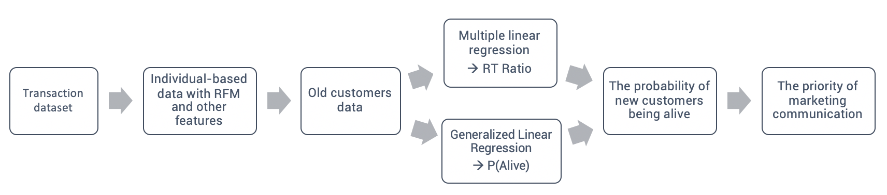

# retention-analysis

# Project: Predicting AsiaYo's customer retention for improving marketing communication

This project was completed as a part of the [Statistical Data Analysis for Business and Management]() from NTU.

In this project, we collaborate with AsiaYo, an online B&B booking platform company headquartered in Taiwan, to work together on solving their business problem using various statistical analysis methods. One challenge facing AsiaYo is customer retention, they want to find a better segmentation method for making more effective marketing communication. Considering each customer has their frequency for booking, we create RFM variables and then define a new variable called RT-Ratio(divide recency by frequency). Finally, we use the data of old customers with RFM and other multiple features to build:
  - (1) Multiple Linear Regression to predict RT-Ratio of new customers
  - (2) GLM model to predict the probability of new customers being alive

- Presentation
- Report
- EDA and Data Preprocessing
- Feature Selection and Modeling
 
  
 
 *Note: Data used in the projects (accessed under data directory) is for demonstration purposes only.*

  
 

  
  
