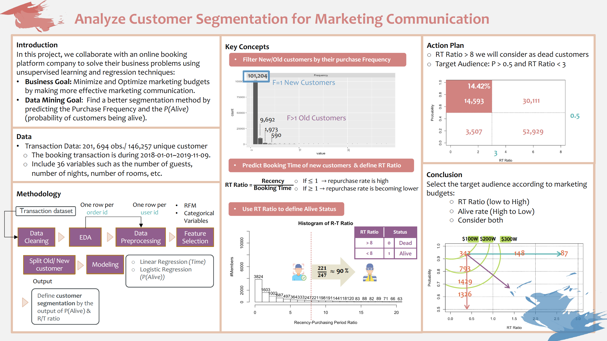

# retention-analysis

## Customer Retention Analysis of Online Booking Platform

This project was completed as a part of the [Statistical Data Analysis for Business and Management](https://github.com/tzuhsuancheng/Statistical-Data-Analysis-for-Business-and-Management) from NTU.

In this project, we collaborate with an online B&B booking platform, to work together on solving their business problem using various statistical analysis methods. One challenge is customer retention, they want to find a better segmentation method for making more effective marketing communication. Considering each customer has their frequency for booking, we create RFM variables and then define a new variable called RT-Ratio(divide recency by frequency). Finally, we use the data of old customers with RFM and other multiple features to build (1) Multiple Linear Regression to predict RT-Ratio of new customers and (2) GLM model to predict the probability of new customers being alive.

- [EDA and Data Preprocessing](https://rpubs.com/tzu0218/722518)
- [Feature Selection and Modeling](https://rpubs.com/tzu0218/723070)
 
 *Note: Data used in the projects (accessed under data directory) is for demonstration purposes only.*

  
 

  
  
