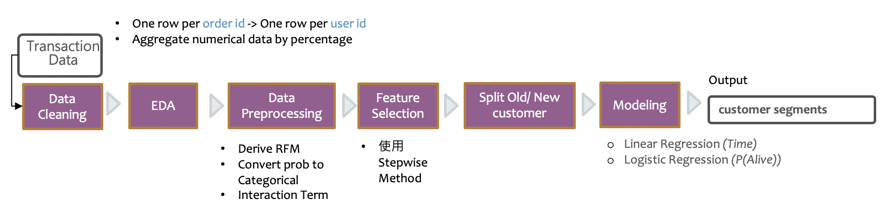
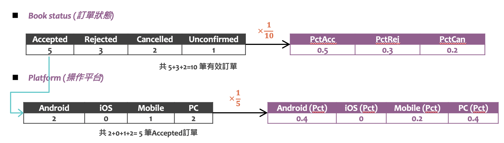
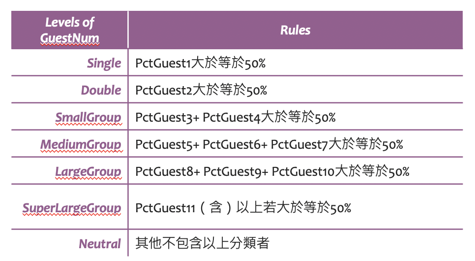
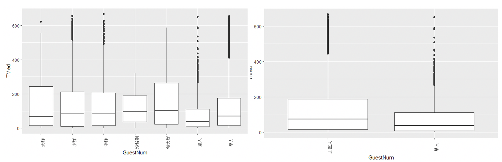

# Customer Retention Analysis of Online Booking Platform

`linear regression` `logistic regression` `R`

## Introduction

In this project, we collaborate with an online B&B booking platform, to work together on solving their business problem using various statistical analysis methods. One challenge is customer retention, they want to find a better segmentation method for making more effective marketing communication

## Goal
- Business Goal: Minimize and Optimize marketing budgets by making more effective marketing communcation.
- Data Mining Goal: Find a better segmentation method by predicting the purchase frequencyand the probability of customers being alive.

## Data
Transaction Data: 201, 694 obs./ 146, 257 unique customer
- The booking transaction is during 2018-01-01~2019-11-09.
- Include 36 variables such as the number of guests, number of nights, number of rooms, etc.

## Workflow

## [EDA & Data Preprocessing](https://rpubs.com/tzu0218/722518)
### EDA

  

- Since TMed is calcualted by Frequency, and RTRatio is calculated by TMed so we would drop these two variables.
- The distribution of TMed is apparently right skewed, which means we can do log transformation.

### Data Preprocessing
1. Convert one row per order id to one row per user id
2. Derive RFM variables
3. Derive Categorical variables
 - Aggregate numerical data by percentage
 - Convert probability to categorical levels
 
 
 EX: Guest Number
 
  

 - Check the levels of each categorical variables using boxplots
 

## [Feature Selection and Modeling](https://rpubs.com/tzu0218/723070)

### Feature Selection
Use Stepwise Method to select the important features

### Model Building

- Split the data
Filter New and Old customers by their purchase frequency
  

- Use the data of old customers with RFM and other multiple features to build:
 (1) Multiple Linear Regression to predict Repurchase Time (Tmed) of new customers
 - We further define RT-Ratio (Recency/Repurchase Time) to better describe the repurchase pattern.
 - Evaluation: R^2 = 0.42
 (2) GLM model to predict the probability of new customers being alive
 - Use RT-Ratio of 8 as the cutoff value to define the alive status of customers
 - Evaluation: Likelihood Ratio Test (The model is good)
 
## Action Plan
- RT Ratio > 8 we will consider as dead customers
- Target Audience: P > 0.5 and RT Ratio < 3
- Select the target audience according to marketing budgets:
 - RT Ratio (low to High)
 - Alive rate (High to Low)
 - Consider both
 
  
 *Note: Data used in the projects (accessed under data directory) is for demonstration purposes only.*

  
 

  
  
